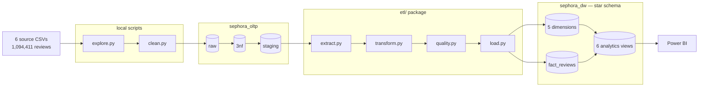
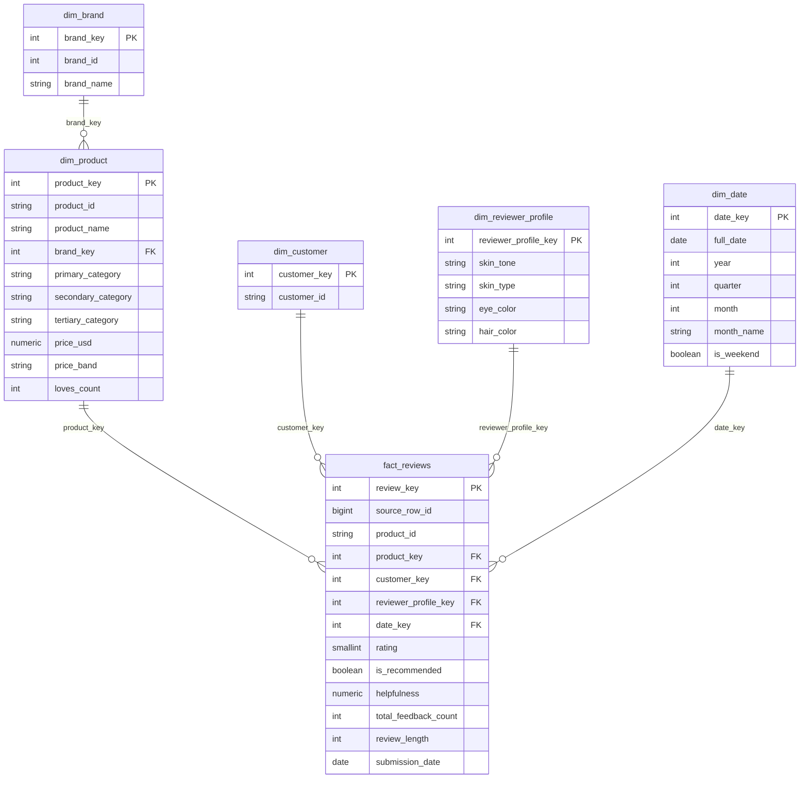

# Sephora Reviews Analytics Warehouse


## Overview

Sephora sells thousands of products across hundreds of brands, and customers have left over a
million reviews against them. The catalogue and the review stream arrive as separate files at
different grains, with product attributes repeated on every review row. Answering something as
basic as *does a higher price actually buy a better-rated product?* means reconciling those
files by hand every time.

This project builds an analytics-ready warehouse from the
[Sephora Products and Skincare Reviews](https://www.kaggle.com/datasets/nadyinky/sephora-products-and-skincare-reviews)
dataset using PostgreSQL, Python, Apache Airflow and Power BI.

## Business questions

The warehouse is structured to answer:

1. Which brands and categories earn the highest ratings, and which underperform?
2. How do review volume and average rating trend over time?
3. Does price predict satisfaction — do expensive products actually rate better?
4. Do reviewers with different skin types rate the same skincare products differently?

## Tech stack

- **Python** — pandas, psycopg2
- **PostgreSQL 16** — two databases: `sephora_oltp` (`raw` + `3nf` + `staging`) and
  `sephora_dw` (star schema)
- **Apache Airflow 3.3.0** — staged DAG, watermark-driven incremental loads
- **Power BI** — dashboard answering the four business questions
- **SQL** — append-only numbered migrations

## Architecture



Three layers in the OLTP database, each with one job: `raw` mirrors the source for
traceability, `3nf` removes the redundancy, `staging` pre-joins it back into the shape the ETL
reads. The warehouse then denormalizes deliberately — that contrast is the point.

## Status

| Stage | State |
|---|---|
| Exploration (`explore.py`, 14 checks) | Complete |
| Cleaning (`clean.py`) | Complete, verified |
| OLTP `raw` + `3nf` + `staging` | Built, loaded, reconciled |
| Star schema warehouse | Built, loaded, verified |
| ETL package + `pipeline.py` | Complete — full / incremental / idempotent all verified |
| Airflow staged DAG | Built, verified |
| Analytics views | Complete — 6 views |
| Power BI dashboard | See "Dashboard" below |

## The data

Every figure below was measured by `explore.py` against the actual files, not taken from the
dataset description.

| | |
|---|---|
| Products | 8,494 (27 columns) |
| Reviews | 1,094,411 across 5 files |
| Reviewers | 503,216 |
| Brands | 304 |
| Date range | 2008-08-28 → 2023-03-21 |
| Products with at least one review | 2,351 of 8,494 |
| Rating distribution | 5★ 698,951 · 4★ 199,389 · 3★ 81,816 · 2★ 53,032 · 1★ 61,223 |

Full profiling, verified relationships and quality findings:
[`docs/problem statement and data sources.md`](docs/problem%20statement%20and%20data%20sources.md).

## The data model

Grain of `fact_reviews`: **one row per review.**



### The decision worth defending

**Reviewer attributes belong to the review, not the reviewer.**

The obvious design puts `skin_tone`, `skin_type`, `eye_color` and `hair_color` on a customer
dimension, keyed uniquely on the reviewer. An earlier version of this schema did exactly that.
Measured against the data, it doesn't hold:

| Attribute | Reviewers with more than one distinct value |
|---|---|
| `skin_tone` | 12,525 |
| `skin_type` | 8,387 |
| `hair_color` | 7,614 |
| `eye_color` | 827 |

**22,503 reviewers (4.47%)** don't have a constant profile, and because prolific reviewers are
over-represented among them, those reviewers account for **149,788 reviews — 13.69% of the
dataset**.

One row per customer forces one profile per person, so roughly **one review in seven** would
be tagged with a profile the reviewer never gave on that review — silently, with no constraint
violation and nothing downstream to notice. It would corrupt business question 4 specifically,
which is the question those attributes exist to answer.

The fix is a **junk dimension**: `dim_reviewer_profile` holds one row per distinct
four-attribute combination (**1,896 rows**), each review points at the combination it actually
recorded, and `dim_customer` keeps identity only.

## The pipeline

Four modules, one responsibility each:

- **`extract.py`** — reads `sephora_oltp.staging`. Dimensions have no time axis and always
  pull in full, so a review for a newly-catalogued product never finds its key missing.
  Reviews come in `_full` (before the 2023-01-01 cutoff) and `_incremental` (after the
  watermark) variants.
- **`transform.py`** — resolves natural keys to surrogate keys via lookup merges, computes
  `price_band`, and drops any row whose merge didn't resolve through `_drop_unmatched`, the
  single choke point that logs every drop.
- **`quality.py`** — a gate, not a fixer. Row count, null keys, negative values, value range,
  unique business key. Raises `DataQualityError` rather than repairing anything: a check that
  quietly fixes what it finds can never fail, so it can never tell you anything.
- **`load.py`** — every insert targets a business key with `ON CONFLICT ... DO NOTHING`, so
  idempotency is enforced by the constraint rather than by the caller remembering.

Orchestrated two ways: `pipeline.py` for local runs, and
`dags/sephora_dw_pipeline_staged.py` for Airflow.

## Airflow DAG

```
create_staging_tables
      ├──> extract_brand ──> load_brand ──> extract_product ──> load_product ─┐
      ├──> extract_customer ──────> load_customer ────────────────────────────┤
      ├──> extract_reviewer_profile ──> load_reviewer_profile ────────────────┤
      ├──> load_date_dimension ───────────────────────────────────────────────┤
      └──> extract_fact_to_staging ──> transform_fact ──> quality_fact ──> load_fact
                                                                              │
                                                                        cleanup_staging
```

Three dimension branches run in parallel; `product` waits on `brand` for the foreign key. The
fact table is split into four staged tasks so each retries independently and the Graph view
names the stage that failed rather than showing one red box.

Each dimension pair writes through a staging table scoped by `batch_id = run_id`, so no
row-level data crosses task boundaries via XCom — XCom is metadata storage, not a data channel.

`cleanup_staging` uses `trigger_rule="all_done"`, so a failed run still clears its own rows.

## Run it

Requires Docker and Python 3.13.

```bash
# 1. deps
python -m venv .venv
.venv/Scripts/activate            # or source .venv/bin/activate
pip install -r requirements.txt
cp .env.example .env              # fill in credentials

# 2. start Postgres (host port 5434; both databases are created on first boot)
docker compose up -d

# 3. explore and clean
python explore.py                 # uncomment the checks you want in main()
python clean.py                   # -> data/processed/

# 4. build and load the OLTP database
psql -h localhost -p 5434 -U postgres -d sephora_oltp -f sql/oltp/01_raw_schema.sql
python ingest.py                  # COPY into raw
for f in sql/oltp/migrations/*.sql; do
  psql -h localhost -p 5434 -U postgres -d sephora_oltp -f "$f"
done

# 5. build the warehouse
for f in sql/datawarehouse/migrations/*.sql; do
  psql -h localhost -p 5434 -U postgres -d sephora_dw -f "$f"
done

# 6. run the pipeline
python pipeline.py --full-reload  # everything before 2023-01-01
python pipeline.py                # incremental - everything after the watermark

# 7. or run it via Airflow instead
docker compose -f docker-compose.yml -f docker-compose-airflow.yml up -d
# open localhost:8081 (airflow/airflow), trigger sephora_dw_pipeline_staged
# with full_reload=true first

# 8. analytics views
for f in sql/analytics/*.sql; do
  psql -h localhost -p 5434 -U postgres -d sephora_dw -f "$f"
done
```

## Verified

Measured against the live database, not assumed.

**Cleaning** — 1,094,411 → 1,093,371 reviews (1,040 duplicates removed on
`(author_id, product_id, submission_time)`); 4,859 `eye_color` `'Grey'` → `'gray'`; 70
`skin_tone` `'notSureST'` → null; 8,494 products unchanged.

**OLTP reconciliation** — 0 row gap across `raw` → `3nf` → `staging` on both products and
reviews, and all six integrity checks return 0: no orphan reviews by product or author, no
product missing a brand or category, no NULL attribute reaching staging, no duplicate natural
key.

**Warehouse loads** — all four run modes:

| Run | Result |
|---|---|
| Full load | **1,043,868** fact rows inserted |
| Idempotency, real case (re-run full) | 1,043,868 offered, **0 inserted** |
| Incremental | watermark 2022-12-31 → **49,503** inserted |
| Idempotency, empty case (re-run incremental) | watermark 2023-03-21 → **0 extracted**, 0 inserted |

**Final warehouse** — `fact_reviews` 1,093,371 rows, matching `staging.review` exactly.
Dimensions: 304 brands · 8,494 products · 503,216 customers · 1,896 reviewer profiles ·
5,379 dates.

**Quality gate** — 8 fault-injection cases in `tests/test_quality.py`, each breaking exactly
one thing (null surrogate key, negative count, out-of-range rating, duplicate business key,
several at once) plus the two that must *not* raise. 8 passed, 0 failed. Proving the gate
rejects bad data matters more than proving it accepts good data — every pipeline run already
demonstrates the latter.

## Design decisions

Full reasoning for all fourteen in [`docs/09_decision_log.md`](docs/09_decision_log.md).
The ones worth knowing:

**The category hierarchy isn't one.** One `secondary_category` appears under as many as 7
different primaries (`Value & Gift Sets`), so category is keyed on the full
(primary, secondary, tertiary) triple rather than modelled as nested levels. A rollup built on
a fake hierarchy would produce wrong totals.

**The dedup key includes the date.** Deduplicating on `(author, product)` would remove 5,525
rows; including `submission_time` removes 1,040. The 4,485-row difference is the same person
reviewing the same product on different dates — real re-reviews, not duplicates.

**`helpfulness` NULLs are never imputed.** `helpfulness IS NULL` corresponds to
`total_feedback_count = 0` on all 1,094,411 rows, with zero disagreements. The value is
undefined because nobody has voted yet, not missing. Filling it with 0 would assert "everyone
who voted found this unhelpful" — a different and false claim.

**Column trims happen at one boundary, not during cleaning.** `clean.py` removes bad rows;
the `raw → 3nf` migrations remove unwanted columns. Doing both in one step makes it impossible
to tell later whether a missing column was a scope decision or a cleaning casualty.

**`highlights` was evaluated, then descoped.** 112 marketing tags covering 82.4% of reviewed
products — the dataset's one genuine many-to-many, which would need its own table plus a
bridge because a cell holding several values breaks 1NF. Cut for scope against an 8-minute
presentation. `explore.py::explore_highlights()` still reports the full distribution, so the
decision is measured rather than accidental.

## Out of scope

Cut deliberately, not overlooked:

- **`highlights`** — evaluated and descoped, see above
- **`ingredients`** — unbounded free text, no locked business question needs it
- **Sentiment analysis / NLP on review text** — the text is kept in the OLTP layer for
  traceability, but no business question asks for it
- **Sparse pricing columns** (`value_price_usd`, `sale_price_usd`, `child_*_price`) — 68–97%
  null and unused
- **Cloud deployment, Spark, object storage** — future-work directions at this data volume

## Layout

```
CLAUDE.md                        goals, per-stage status, measured numbers
explore.py                       14 profiling checks, toggled in main()
clean.py                         raw CSVs -> data/processed/
ingest.py                        processed CSVs -> raw schema via COPY
pipeline.py                      local runner: --full-reload / incremental
docker-compose.yml               project Postgres (host port 5434)
docker-compose-airflow.yml       Airflow 3.3.0, LocalExecutor (port 8081)
dags/
  sephora_dw_pipeline_staged.py  staged DAG
etl/
  extract.py                     staging -> DataFrames, full + incremental
  transform.py                   key resolution, derived columns, drop-unmatched
  quality.py                     pre-load quality gate
  load.py                        upserts with ON CONFLICT DO NOTHING
  staging.py                     staging-table helpers for the DAG
sql/
  init/                          database creation on first container boot
  oltp/01_raw_schema.sql
  oltp/migrations/               3nf DDL -> staging DDL -> loads -> reconciliation
  datawarehouse/migrations/      01..07, star schema DDL, append-only
  analytics/                     6 dashboard-backing views + cross-checks
tests/
  test_quality.py                fault injection for the quality gate
docs/
  problem statement and data sources.md
  09_decision_log.md
  project_plan.pdf
  screenshots/
logs/                            per-run logs, timestamped
```

## Author

**Samekshya Baniya**
Data Engineering
