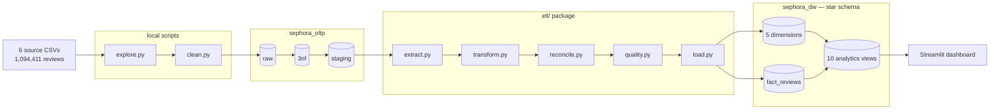
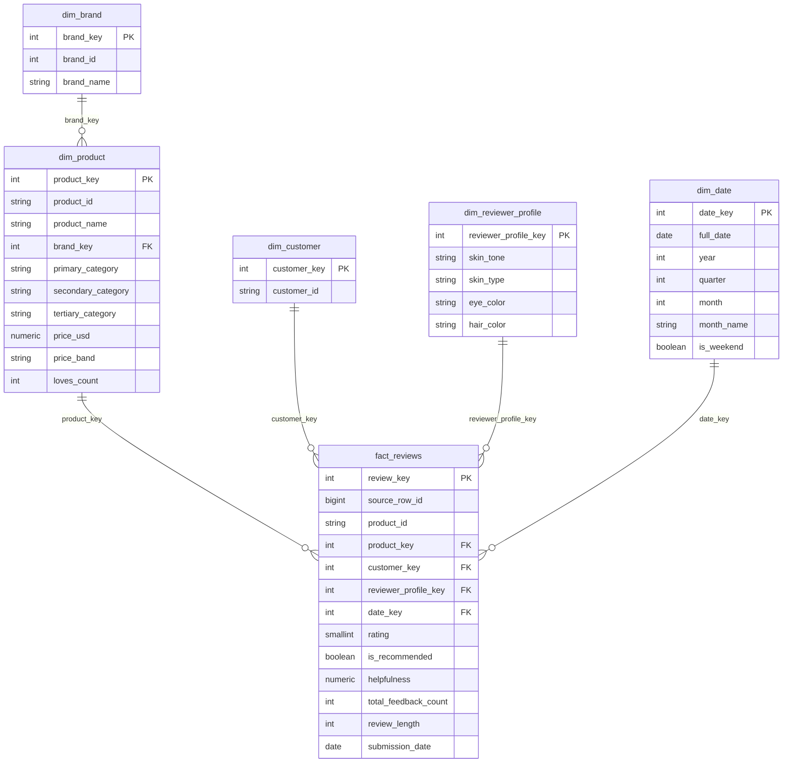
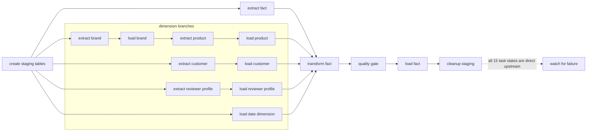
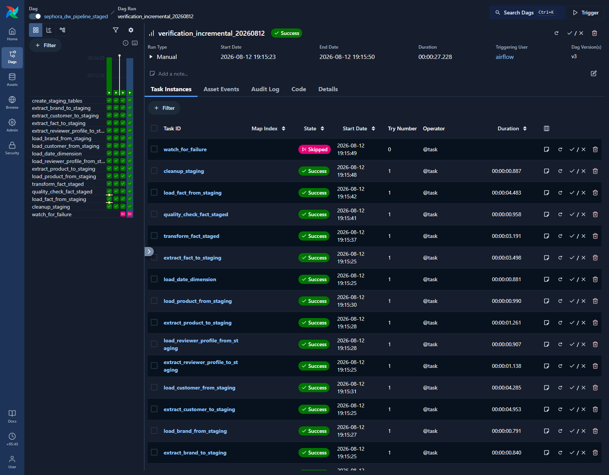
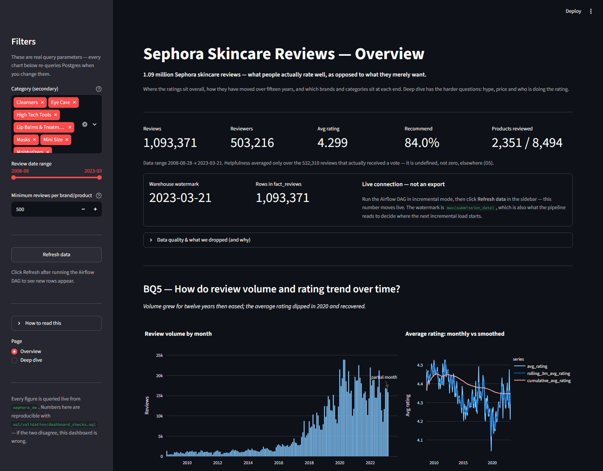

# Sephora Reviews Analytics Warehouse


## Overview

Sephora sells thousands of products across hundreds of brands, and customers have left over a
million reviews against them. The catalogue and the review stream arrive as separate files at
different grains, with product attributes repeated on every review row. Answering something as
basic as *does a higher price actually buy a better-rated product?* means reconciling those
files by hand every time.

This project builds an analytics-ready warehouse from the
[Sephora Products and Skincare Reviews](https://www.kaggle.com/datasets/nadyinky/sephora-products-and-skincare-reviews)
dataset using PostgreSQL, Python, Apache Airflow and Streamlit.

## Business questions

The warehouse is structured to answer:

1. Which brands and skincare categories earn the highest ratings, and which underperform?
2. **Hype vs reality** — which products have high `loves_count` but low ratings?
3. Does price predict satisfaction — do expensive products actually rate better?
4. Do reviewers with different skin types and tones rate the same products differently?
5. How do review volume and average rating trend over time?

> **Scope note.** The catalogue covers 8,494 products across 9 categories, but only
> **Skincare** products carry reviews — 2,351 of them, holding all 1,093,371 reviews. The
> source is *Sephora Products and Skincare Reviews*: the catalogue was scraped in full, the
> reviews only for skincare. Category analysis therefore runs at the **secondary** level
> (Moisturizers, Treatments, Cleansers…), and no claim is made about Sephora as a whole. See
> D16.

## Tech stack

- **Python** — pandas, psycopg2
- **PostgreSQL 16** — two databases: `sephora_oltp` (`raw` + `3nf` + `staging`) and
  `sephora_dw` (star schema)
- **Apache Airflow 3.3.0** — staged DAG, watermark-driven incremental loads
- **Streamlit + Plotly** — 2-page dashboard, live connection, answering the five business questions (D18)
- **SQL** — append-only numbered migrations

## Architecture



Three layers in the OLTP database, each with one job: `raw` mirrors the source for
traceability, `3nf` removes the redundancy, `staging` pre-joins it back into the shape the ETL
reads. The warehouse then denormalizes deliberately — that contrast is the point.

## Status

| Stage | State |
|---|---|
| Exploration (`explore.py`, 14 checks) | Complete |
| Cleaning (`clean.py`) | Complete, verified |
| OLTP `raw` + `3nf` + `staging` | Built, loaded, reconciled |
| Star schema warehouse | Built, loaded, verified |
| ETL package + `pipeline.py` | Complete — three modes, reconciliation, idempotency all verified |
| Airflow staged DAG | Complete — 16 tasks, failure watcher, both modes green |
| Analytics views | Complete — 10 views, all full-population views reconciling to `fact_reviews` |
| Streamlit dashboard | Complete — 2 pages, live, smoke-tested against the warehouse |
| Tests | 51 passing + 11 DAG assertions verified in-container |
| Documentation | Complete — [`docs/`](docs/README.md), 11 numbered documents |

## The data

Every figure below was measured by `explore.py` against the actual files, not taken from the
dataset description.

| | |
|---|---|
| Products | 8,494 (27 columns) |
| Reviews | 1,094,411 across 5 files |
| Reviewers | 503,216 |
| Brands | 304 |
| Date range | 2008-08-28 → 2023-03-21 |
| Products with at least one review | 2,351 of 8,494 — **all of them Skincare** (D16) |
| Rating distribution | 5★ 698,951 · 4★ 199,389 · 3★ 81,816 · 2★ 53,032 · 1★ 61,223 |

Full profiling, verified relationships and quality findings:
[`docs/02_data_quality_findings.md`](docs/02_data_quality_findings.md).

## The data model

Grain of `fact_reviews`: **one row per review.**



### The decision worth defending

**Reviewer attributes belong to the review, not the reviewer.**

The obvious design puts `skin_tone`, `skin_type`, `eye_color` and `hair_color` on a customer
dimension, keyed uniquely on the reviewer. An earlier version of this schema did exactly that.
Measured against the data, it doesn't hold:

| Attribute | Reviewers with more than one distinct value |
|---|---|
| `skin_tone` | 12,525 |
| `skin_type` | 8,387 |
| `hair_color` | 7,614 |
| `eye_color` | 827 |

**22,503 reviewers (4.47%)** don't have a constant profile, and because prolific reviewers are
over-represented among them, those reviewers account for **149,788 reviews — 13.69% of the
dataset**.

One row per customer forces one profile per person, so roughly **one review in seven** would
be tagged with a profile the reviewer never gave on that review — silently, with no constraint
violation and nothing downstream to notice. It would corrupt business question 4 specifically,
which is the question those attributes exist to answer.

The fix is a **junk dimension**: `dim_reviewer_profile` holds one row per distinct
four-attribute combination (**1,896 rows**), each review points at the combination it actually
recorded, and `dim_customer` keeps identity only.

## The pipeline

Four modules, one responsibility each:

- **`extract.py`** — reads `sephora_oltp.staging`. Dimensions have no time axis and always
  pull in full, so a review for a newly-catalogued product never finds its key missing.
  Reviews come in `_full` (before the 2023-01-01 cutoff) and `_incremental` (after the
  watermark) variants.
- **`transform.py`** — resolves natural keys to surrogate keys via lookup merges, computes
  `price_band`, and drops any row whose merge didn't resolve through `_drop_unmatched`, the
  single choke point that logs every drop.
- **`quality.py`** — a gate, not a fixer. Row count, null keys, negative values, value range,
  unique business key. Raises `DataQualityError` rather than repairing anything: a check that
  quietly fixes what it finds can never fail, so it can never tell you anything.
- **`load.py`** — every insert targets a business key with `ON CONFLICT ... DO NOTHING`, so
  idempotency is enforced by the constraint rather than by the caller remembering.

Orchestrated two ways: `pipeline.py` for local runs, and
`dags/sephora_dw_pipeline_staged.py` for Airflow.

## Airflow DAG



Three dimension branches run in parallel; `product` waits on `brand` for the foreign key. The
fact table is split into four staged tasks so each retries independently and the Graph view
names the stage that failed rather than showing one red box.

Each dimension pair writes through a staging table scoped by `batch_id = run_id`, so no
row-level data crosses task boundaries via XCom — XCom is metadata storage, not a data channel.

`cleanup_staging` uses `trigger_rule="all_done"`, so a failed run still clears its own rows.
The watcher uses `one_failed`, receives **all 15 other tasks as direct
upstreams**, and is the DAG's only leaf. The diagram collapses those 15 watcher
edges into the dashed annotation so the execution path remains readable.



## Run it

Requires Docker and Python 3.13. Place the Kaggle CSVs in `data/raw/` first —
see [`data/README.md`](data/README.md).

### The one-command path (Windows)

```powershell
.\setup.ps1
```

Runs prerequisites → Postgres → schemas → clean → ingest → 3NF/staging
migrations → warehouse migrations → views → pytest → Airflow. Every step is
idempotent, so re-running is the intended way to recover from a failure. Resume
a single step with `.\setup.ps1 -Step 6`.

Then trigger the DAG twice at <http://localhost:8081> (`historical`, then
`incremental`), and:

```powershell
.\setup.ps1 -Step 11                        # validate every total
py -m streamlit run dashboard/app.py        # dashboard on :8501
```

### Manually

```powershell
py -m pip install -r requirements.txt -r requirements-dev.txt
Copy-Item .env.example .env                 # working local defaults already in it

docker compose up -d                        # Postgres on 5434, both databases

py explore.py                               # uncomment the checks you want
py clean.py                                 # -> data/processed/

# OLTP: raw schema, ingest, then the numbered migrations in order
py ingest.py
# (setup.ps1 -Step 3, -Step 6 apply the SQL; or psql each file yourself)

# Warehouse: star schema, then the views
# (setup.ps1 -Step 7)

# Load — three explicit modes
py pipeline.py --mode full                  # every review, no date bound
py pipeline.py --mode historical            # before 2023-01-01 (demo baseline)
py pipeline.py --mode incremental           # after the watermark (default)

# Or via Airflow
docker compose -f docker-compose-airflow.yml up -d
# localhost:8081 -> sephora_dw_pipeline_staged -> Trigger -> pick load_mode
```

## Dashboard

```powershell
py -m streamlit run dashboard/app.py     # http://localhost:8501
```

Two pages, **live** Postgres connection — not a static export. Run the DAG in
`incremental` mode, click **Refresh data**, and the review count moves on screen.

Reads the curated views rather than raw fact/dim joins, so the dashboard and
`sql/validation/dashboard_checks.sql` share one definition of every number. **If the two
disagree, the dashboard is wrong.**

Charts state their own caveats rather than hoping nobody asks: the price and skin-profile
y-axes are truncated (the whole spread is about a tenth of a star, and a zero-based axis
renders five identical bars), the incomplete final month is annotated `partial month`, and the
brand chart says how many of the 304 brands clear the current review floor.

See [`dashboard/README.md`](dashboard/README.md) for what each visual shows and
[`docs/07_dashboard_insights.md`](docs/07_dashboard_insights.md) for the findings.



The Deep dive can also be opened directly at
<http://localhost:8501/?page=deep-dive> for a stable presentation link.

## Presentation

The completed eight-minute deck is available as an editable
[`PowerPoint`](presentation/output/Sephora_Analytics_Pipeline.pptx) and a
portable [`PDF`](presentation/output/Sephora_Analytics_Pipeline.pdf). See
[`presentation/README.md`](presentation/README.md) for the timed slide sequence,
speaker notes, and reproducible build command.

### The headline finding

Price does **not** predict satisfaction linearly. It is an inverted U:

| Price band | Avg rating | Std dev |
|---|---|---|
| Under $15 | 4.2383 | 1.2211 |
| $15–30 | 4.2756 | 1.1861 |
| $30–50 | 4.3055 | 1.1498 |
| **$50–100** | **4.3335** ← peak | 1.0996 |
| $100+ | 4.2708 ← falls back | 1.1366 |

The mean is the weaker half of it. The **standard deviation falls steadily** as price rises —
expensive products aren't mainly rated *higher*, they're rated far more **consistently**.
Above $100 satisfaction drops back to roughly what a $15 product achieves.

## Verified

Measured against the live database, not assumed.

**Cleaning** — 1,094,411 → 1,093,371 reviews (1,040 duplicates removed on
`(author_id, product_id, submission_time)`); 4,859 `eye_color` `'Grey'` → `'gray'`; 70
`skin_tone` `'notSureST'` → null; 8,494 products unchanged.

**OLTP reconciliation** — 0 row gap across `raw` → `3nf` → `staging` on both products and
reviews, and all six integrity checks return 0: no orphan reviews by product or author, no
product missing a brand or category, no NULL attribute reaching staging, no duplicate natural
key.

**Warehouse loads**:

| Run | Result |
|---|---|
| Historical load (`--mode historical`) | **1,043,868** fact rows inserted |
| Idempotency, real case (re-run) | 1,043,868 offered, **0 inserted** |
| Incremental | watermark 2022-12-31 → **49,503** inserted |
| Idempotency, empty case (re-run incremental) | watermark 2023-03-21 → **0 extracted**, 0 inserted |

**Final warehouse** — `fact_reviews` 1,093,371 rows, matching `staging.review` exactly.
Dimensions: 304 brands · 8,494 products · 503,216 customers · **1,896** reviewer profiles ·
5,379 dates.

**Tests** — **51 passing**, plus 11 DAG structural assertions verified inside the Airflow
container. Fault injection is the core of it: the suite proves the quality gate *rejects* bad
data, which matters more than proving it accepts good data — every pipeline run already
demonstrates the latter. See [`docs/08_testing_evidence.md`](docs/08_testing_evidence.md) for
what each test proves.

**Row accounting** — every dropped row is counted against a named reason
(`unresolved_product`, `unresolved_customer`, `unresolved_reviewer_profile`,
`out_of_range_date`), and an unexplained gap raises `ReconciliationError` rather than shipping
a short table.

**Dashboard totals** — all 8 full-population views reconcile to exactly 1,093,371, verified by
`sql/validation/dashboard_checks.sql`.

## Design decisions

Full reasoning for all **22** in [`docs/09_decision_log.md`](docs/09_decision_log.md).
The ones worth knowing:

**Reviewer attributes belong to the review, not the reviewer.** 22,503 authors (4.47%) gave
more than one distinct answer for skin type / tone / eye / hair, across 149,788 reviews
(13.69%). A `dim_customer` keyed on the author and holding those four columns would force one
profile per person and mis-tag roughly one review in seven — silently, with no constraint
violation. They live on a junk dimension, `dim_reviewer_profile` (1,896 rows), at the grain
they were actually recorded. **D2**, and the single most important decision here.

**A failed DAG run now reports failure.** `cleanup_staging` uses `trigger_rule="all_done"` so
it cleans up after a failure — which made it the only leaf task, and Airflow derives run state
from leaves. A failed extract therefore produced a *green* run over an empty warehouse.
`watch_for_failure` (`one_failed`, the only leaf) fixes it. **D20**.

**Three load modes, because `--full-reload` wasn't one.** It stopped at 2023-01-01 — a
historical baseline whose name claimed otherwise, and there was no way to load everything in
one command. Now `full` / `historical` / `incremental`. **D17**.

**The category hierarchy isn't one.** One `secondary_category` appears under as many as 7
different primaries (`Value & Gift Sets`), so category is keyed on the full
(primary, secondary, tertiary) triple rather than modelled as nested levels. A rollup built on
a fake hierarchy would produce wrong totals.

**The dedup key includes the date.** Deduplicating on `(author, product)` would remove 5,525
rows; including `submission_time` removes 1,040. The 4,485-row difference is the same person
reviewing the same product on different dates — real re-reviews, not duplicates.

**`helpfulness` NULLs are never imputed.** `helpfulness IS NULL` corresponds to
`total_feedback_count = 0` on all 1,094,411 rows, with zero disagreements. The value is
undefined because nobody has voted yet, not missing. Filling it with 0 would assert "everyone
who voted found this unhelpful" — a different and false claim.

**Column trims happen at one boundary, not during cleaning.** `clean.py` removes bad rows;
the `raw → 3nf` migrations remove unwanted columns. Doing both in one step makes it impossible
to tell later whether a missing column was a scope decision or a cleaning casualty.

**`highlights` was evaluated, then descoped.** 112 marketing tags covering 82.4% of reviewed
products — the dataset's one genuine many-to-many, which would need its own table plus a
bridge because a cell holding several values breaks 1NF. Cut for scope against an 8-minute
presentation. `explore.py::explore_highlights()` still reports the full distribution, so the
decision is measured rather than accidental.

## Out of scope

Cut deliberately, not overlooked:

- **`highlights`** — evaluated and descoped, see above
- **`ingredients`** — unbounded free text, no locked business question needs it
- **Sentiment analysis / NLP on review text** — the text is kept in the OLTP layer for
  traceability, but no business question asks for it
- **Sparse pricing columns** (`value_price_usd`, `sale_price_usd`, `child_*_price`) — 68–97%
  null and unused
- **Cloud deployment, Spark, object storage** — future-work directions at this data volume

## Layout

```
CLAUDE.md                        goals, per-stage status, measured numbers
setup.ps1                        one-sequence setup, 11 resumable steps
explore.py                       14 profiling checks, toggled in main()
clean.py                         raw CSVs -> data/processed/
ingest.py                        processed CSVs -> raw schema via COPY
pipeline.py                      local runner: --mode full|historical|incremental
docker-compose.yml               project Postgres (host port 5434)
docker-compose-airflow.yml       Airflow 3.3.0, LocalExecutor (port 8081)
dags/
  sephora_dw_pipeline_staged.py  staged DAG, 16 tasks
etl/
  extract.py                     staging -> DataFrames, three load modes
  transform.py                   key resolution, derived columns, counted drops
  reconcile.py                   row-count identities; raises on unexplained loss
  quality.py                     pre-load gate, hard_failure / warning severity
  load.py                        inserts with ON CONFLICT DO NOTHING
  staging.py                     per-run staging-table helpers for the DAG
dashboard/
  app.py                         Streamlit, 2 pages, live connection
  README.md                      what each visual shows
  data_model.md                  which tables and views it reads
sql/
  init/                          database creation on first container boot
  oltp/01_raw_schema.sql
  oltp/migrations/               3nf DDL -> staging DDL -> loads -> reconciliation
  datawarehouse/migrations/      01..07, star schema DDL, append-only
  analytics/views/               9 dashboard-backing views (one uses window functions)
  validation/                    read-only checks; changes nothing
tests/
  unit/                          quality gate + transform, no database needed
  integration/                   live-database reconciliation + dashboard smoke
  test_dag_structure.py          DAG wiring (skips without airflow)
  verify_dag_in_container.py     the same assertions, plain python, in-container
docs/
  README.md                      documentation index
  01..11                         problem statement -> walkthrough
  archive/                       superseded docs, kept
  screenshots/                   presentation captures
data/README.md                   where to get the CSVs and where to put them
logs/                            per-run logs, timestamped
```

## Author

**Samekshya Baniya**
Data Engineering
